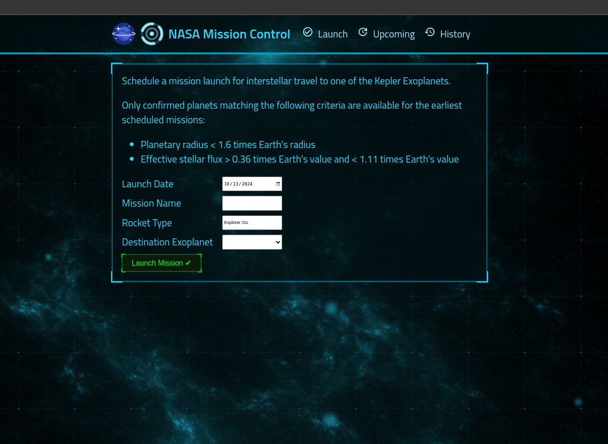
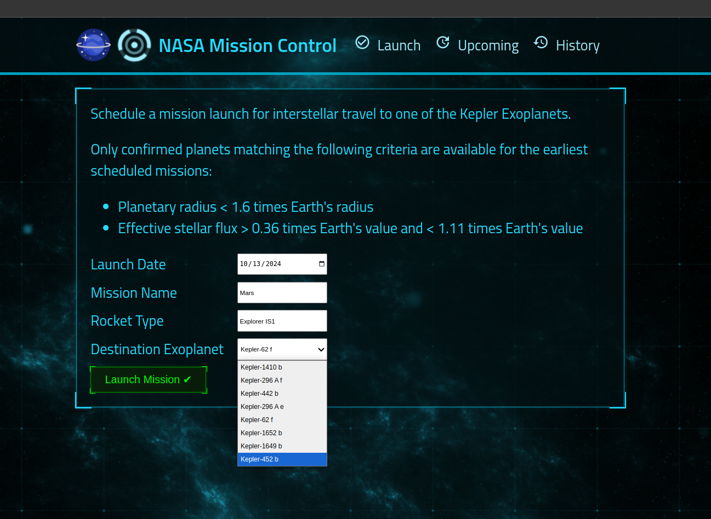
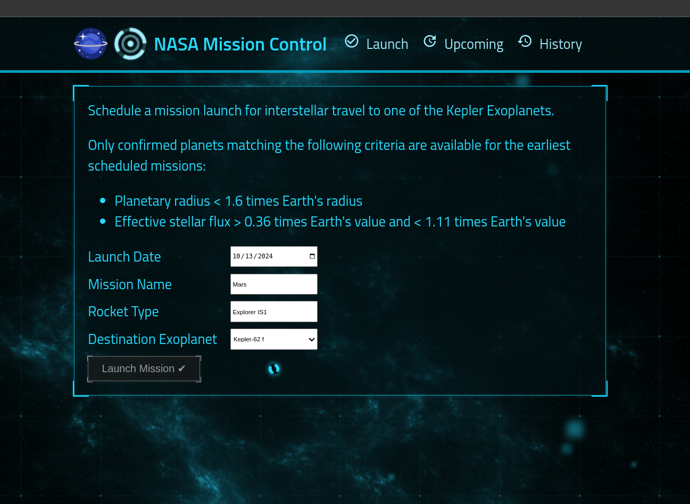
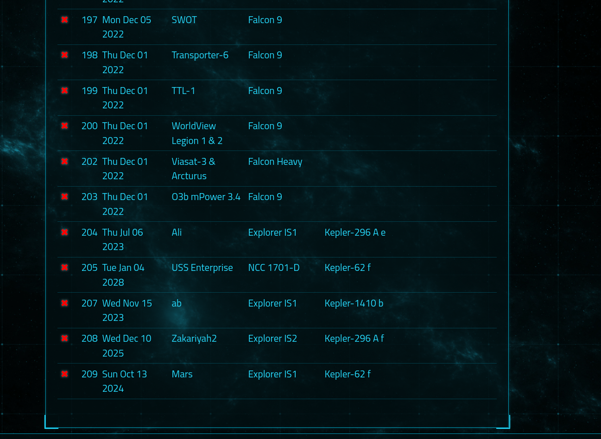
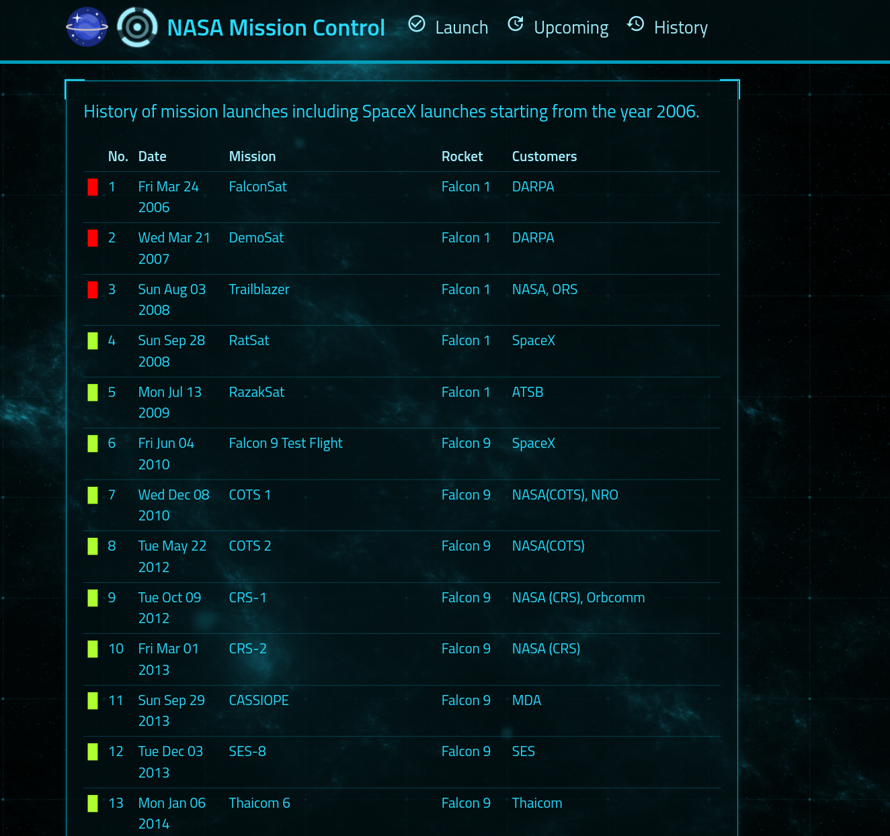

<h1 align="center">NASA Project</h1>

<div align="center">

[]()
[](https://github.com/alibaba0010/authentication-and-authorisation-with-expressjs/issues)
[](https://github.com/kylelobo/The-Documentation-Compendium/pulls)
[](/LICENSE)

</div>

## 📝 Table of Contents

- [About](#about)
- [Getting Started](#getting_started)
- [Screenshots](#images)
- [Authors](#authors)
- [Acknowledgments](#acknowledgement)

## 🏁 About <a name = "about"></a>

This NASA project leverages NASA's public API to retrieve planetary data and integrates a third-party API for launch information. It also implements a robust CRUD (Create, Read, Update, Delete) application to allow users to interact with and manage the collected data. The project provides a user-friendly interface for exploring planetary facts, tracking launches, and saving customized data.

## 🏁 Getting Started <a name = "getting_started"></a>

1. Ensure you have Node.js installed.
2. Create a free [Mongo Atlas](https://www.mongodb.com/atlas/database) database online or start a local MongoDB database.
3. Create a `server/.env` file with the properties specified in config.js file in services directory and add to the ".env" file.

```sh
In the terminal,

# Install dependencies
npm install

## Running the Project
In the terminal, run:

npm run watch

```

## Screenshots <a name = "images"></a>







## ✍️ Authors <a name = "authors"></a>

- [@alibaba](https://github.com/alibaba0010) - Idea & Initial work

## 🎉 Acknowledgements <a name = "acknowledgement"></a>

- [Zero to Mastery](https://academy.zerotomastery.io/a/aff_jqtq5631/external?affcode=441520_1jw4f2ay)
